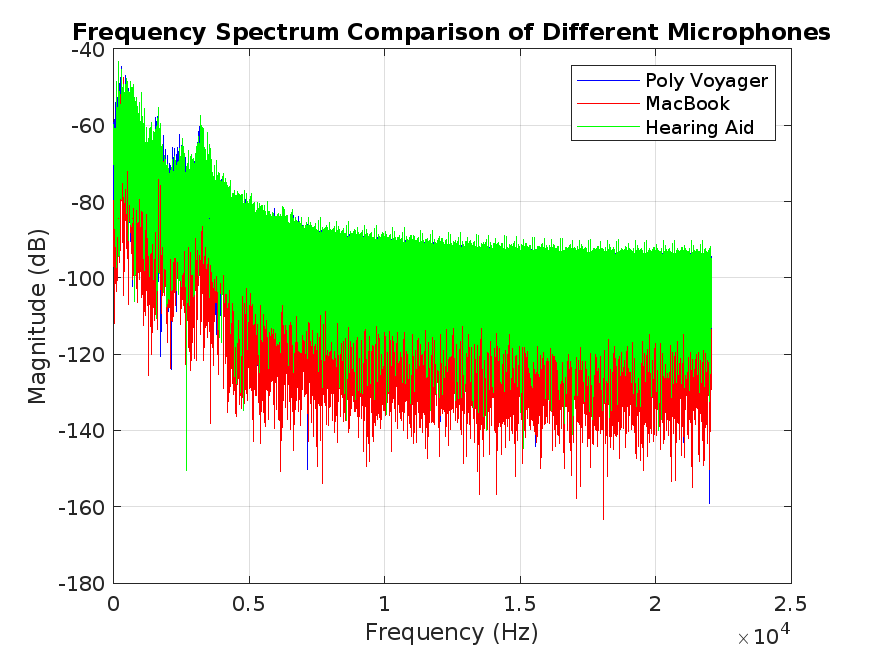

# Microphone Comparison Project

## Overview

This project compares the audio quality of three different microphones using MATLAB:
- **Poly Voyager** headset microphone
- **MacBook** built-in microphone
- **Hearing Aid** microphone

The comparison is based on the frequency spectrum analysis of recorded audio samples. The goal is to identify how each microphone performs in capturing audio across different frequencies and to determine which microphone provides the best sound quality in different environments.

## Project Structure

- **`CompareMicrophones.m`**: This script loads the audio recordings from each microphone, performs a Fast Fourier Transform (FFT) to analyze the frequency content, and plots the frequency spectra for comparison.
- **`PolyVoyager.m`**: Records audio using the Poly Voyager microphone.
- **`MacBook.m`**: Records audio using the MacBook's built-in microphone.
- **`HearingAid.m`**: Records audio using the hearing aid microphone.
- **Audio Files**:
  - `PolyVoyagerRecording.wav`: The recorded audio from the Poly Voyager.
  - `MacBookRecording.wav`: The recorded audio from the MacBook.
  - `HearingAidRecording.wav`: The recorded audio from the hearing aid.
- **`MicrophoneComparison.png`**: The resulting frequency spectrum comparison plot, showing the performance of each microphone.

## Getting Started

### Prerequisites

- MATLAB (preferably with access to MATLAB Online)
- A set of microphones, including the Poly Voyager headset, MacBook built-in microphone, and a hearing aid microphone.

### Instructions

1. **Record Audio**:
   - Run the `PolyVoyager.m` script to record audio using the Poly Voyager headset.
   - Run the `MacBook.m` script to record audio using the MacBook built-in microphone.
   - Run the `HearingAid.m` script to record audio using the hearing aid microphone.

2. **Compare Microphones**:
   - Run the `CompareMicrophones.m` script to generate the frequency spectrum comparison plot.

3. **View Results**:
   - The `MicrophoneComparison.png` file provides a visual comparison of the microphones' frequency response.

## Analysis

The analysis indicates how each microphone performs across different frequencies:
- **Poly Voyager**: Shows selective sensitivity, potentially optimized for certain frequency ranges due to its design for communication purposes.
- **MacBook**: Provides a balanced response across the frequency spectrum, making it suitable for general-purpose recording.
- **Hearing Aid**: Has strong low-frequency sensitivity, which may be a design choice to enhance speech clarity.

## Conclusion

This project allows users to compare the audio performance of different microphones using MATLAB. The results can help users choose the right microphone for specific applications or environments.

## Example Frequency Spectrum Comparison

